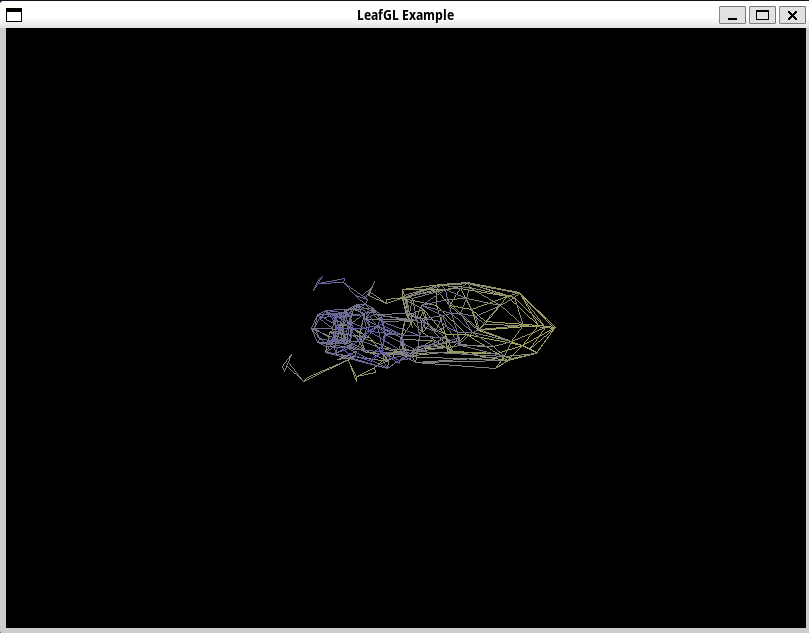

<p align="center">
    <br/><br/>Simple 3D Graphics Library
    compatible with C and C++, written in C.<br/><br/>
</p>

# LeafGL

## What is LeafGL?
LeafGL is a fully functional 3D renderer built in c, in which you can manipulate 3d models of your choice.

## Prequisites

for the lightweight installation of Leafgl, you will need to install SDL2, and scons.
The SDL2 installation process on ubuntu is quite simple, as shown below:
```
sudo apt-get update
sudo apt-get install libsdl2-2.0-0 libsdl2-dev build-essential
sudo apt install scons
```

And so for archlinux, the installation is very simple. (FINALLY)
```
sudo pacman -S --noconfirm sdl2_image sdl2_mixer sdl2_ttf scons
```

## Main Installation
to fully install the LeafGL Library, it is nessesary you execute `scons` to fully install the LeafGL Library.
If done right, you will have a folder as such: `/usr/include/GLEWF/`

## Usage
A fully-functional example script is given (`./examples/example.c` && `./examples/Makefile`) for clarity of the library for the user.
> [!NOTE]
> Be sure to change the #include paths to fit the new installation, or wherever moved.
